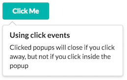
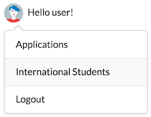
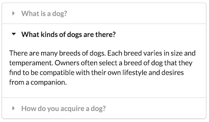

# semantic-ui-popup-canjs
CanJS wrapper around SemanticUI modules

A [can.view.attr](https://canjs.com/docs/can.view.attr.html) wrapper around [SemanticUI modules](http://semantic-ui.com/modules/accordion.html). With `can.view.attr` you can add custom behavior to elements that contain a specified html attribute. Since SemanticUI is a set of jQuery plugins, `can.view.attr` is a natural way to invoke them in a [CanJS](https://canjs.com) or [DoneJS](https://donejs.com/) application.

This wrapper allows you to use SemanticUI modules like popup or accordion with just html, no need to run jQuery plugin yourself.

SemanticUI's CSS should be imported separately. You can use `semantic-ui-less` package as in this demo.

Settings of an individual module can be defined as "semantic"-prefixed attributes. E.g. to define `position` for the popup module as `bottom left` you can add `semantic-position="bottom left"` attribute (see Usage section).

If you need to use SemanticUI Popup `callbacks` then you are probably a jQuery-style guy and you don't need this wrapper :)

*Note: don't forget to install SemanticIO individual modules if you don't import the whole SemanticUI framework.*

## Demo

See the included demo /demo/demo.html (run `npm install`, then `http-server` in the project root and browse /demo/demo.html).

  

## Installation
```
Install the wrapper:
$ npm install semantic-ui-canjs --save

And install the desired SemanticUI modules (if you don't load the whole SemanticUI JavaScript):
$ npm install semantic-ui-popup semantic-ui-transition semantic-ui-accordion --save

If you import individual SemanticUI modules don't forget that some modules might require others (e.g. Popup requires Transition, etc).
```

## Usage
```
   <can-import from="semantic-ui-canjs" />
   <can-import from="semantic-ui-popup/popup" />
   <can-import from="semantic-ui-transition/transition" />
   <can-import from="semantic-ui-accordion/accordion" />

   Popup module with default settings:
   <div class="ui icon button" semantic-module="popup" data-content="Add users to your feed">Add</div>

   Popup with custom settings:
   <a class="browse" semantic-module="popup"
                     semantic-inline="true"
                     semantic-on="click"
                     semantic-position="bottom left">Button</a>

   Accordion module:
   <div class="ui styled accordion" semantic-module="accordion">...</div>
```

## API

Attributes:
- `semantic-module="<module name>"` - main attribute to invoke the wrapper.
- `semantic-*` - use any of module's settings with this prefix. E.g. popup's `semantic-position="bottom left"` or  `semantic-hoverable="true"`.

## Contributing
Pull requests are welcome.

## Authors
- [Ilya Fadeev](https://github.com/ilyavf)